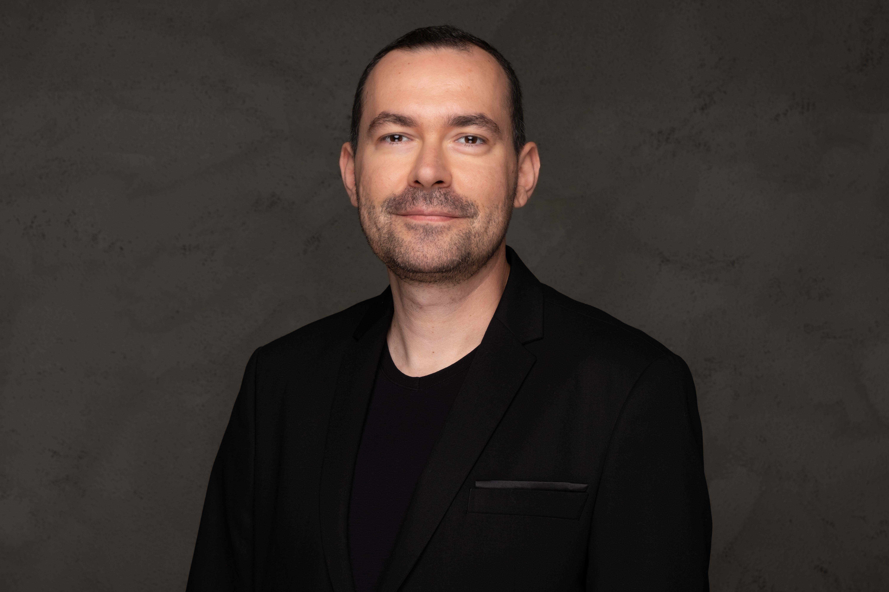

I am an associate professor in the Department of Translation and Interpreting at Hacettepe University. My research investigates language, memory and embodied cognition from data science and psycholinguistic perspectives. I publish in national and international journals, and I am currently supervising graduate research projects in psycholinguistics, cognitive translation and interpreting studies. I am experienced in designing behavioural and eye-tracking experiments, programming in Python, conducting statistical analyses using ([R](https://www.r-project.org), and creating data visualisations with (`ggplot2`).

I act as a referee for several international journals, including *Cognition*, *Psychological Research*, *Memory*, *The Quarterly Journal of Experimental Psychology*, *Frontiers in Psychology*, *Humanities and Social Sciences Communications*, and *The Interpreter and Translator Trainer*, as well as for grants from the Scientific and Technological Research Council of Türkiye (TÜBİTAK). I am co-editor of the John Benjamins publication [Translation, Cognition & Behavior](https://benjamins.com/catalog/tcb). Previously, I was an associate editor of the Hacettepe University Journal of the Faculty of Letters. I am the proud recipient of the 2019 Hacettepe University Science Incentive Award in the Social Sciences.

I am a supporter of [open, transparent and reproducible science](https://osf.io/5egx4). In my spare time, I enjoy writing, coding and analysing data while listening to my [custom playlists](https://open.spotify.com/playlist/3Ks2Fpf7mG3zhYgqjJS9IZ?si=25XXs-0NTSGIc0R5Delgsw). I believe that the future lies in interdisciplinary research. Watch the video below to learn more about my academic journey (courtesy of the Digital Story Hub at the Faculty of Communication at Hacettepe University).

<iframe src="https://player.vimeo.com/video/707729933?h=ae0ce85e30&loop=1" style="position:absolute;top:0;left:0;width:100%;height:100%;" frameborder="0" allow="autoplay; fullscreen; picture-in-picture" allowfullscreen></iframe>

 

# Education
* PhD in Psychology, 2019 
University of Birmingham 
Thesis title: Looking for language in space: Spatial simulations in memory for language (<a href="https://etheses.bham.ac.uk/id/eprint/8842/" target="_blank">.Birmingham etheses</a>) (<a href="thesis">Responsive web</a>) 
Supervisor: Dr Robin L Thompson 
Viva examiners: Dr Steven Frisson (University of Birmingham), Dr Daniel Richardson (University College London)

* MSc in Psychology, 2014 (distinction) 
University of Birmingham 
Thesis title: Effect of speech rate and overlapping on multimodal language processing: Evidence from eye movements (<a href="pdfs/Effect of Speech Rate and Overlapping on Multimodal Language Processing.pdf" target="_blank">.pdf</a>) 

* MA in Translation & Interpreting, 2011 
Hacettepe University 
Thesis title: Visual focal loci in simultaneous interpreting (<a href="pdfs/Visual Focal Loci in Simultaneous Interpreting.pdf" target="_blank">.pdf</a>) 

* BA in Translation & Interpreting, 2008 
Hacettepe University

# Interests
* Psycholinguistics
* Memory for language
* Grounded-embodied cognition
* Cognitive translation & interpreting studies

# IDs
* <a href="https://orcid.org/0000-0003-0844-3562" target="_blank">ORCID</a>
* <a href="https://www.webofscience.com/wos/author/record/E-5568-2012" target="_blank">Web of Science</a>
* <a href="https://scholar.google.com/citations?hl=tr&user=xNlBSa4AAAAJ" target="_blank">Google Scholar</a>
* <a href="https://www.scopus.com/authid/detail.uri?authorId=57203865908" target="_blank">Scopus</a> 
* <a href="https://www.researchgate.net/profile/Alper_Kumcu" target="_blank">Research Gate</a>
* <a href="https://profiles.impactstory.org/u/0000-0003-0844-3562" target="_blank">Impact Story</a>
* <a href="https://philpeople.org/profiles/alper-kumcu" target="_blank">PhilPeople</a>
* <a href="https://loop.frontiersin.org/people/125772/overview" target="_blank">Loop</a>
* <a href="https://osf.io/5egx4/" target="_blank">Open Science Framework (OSF)</a>
* <a href="https://github.com/alperkumcu" target="_blank">GitHub</a>
* <a href="https://gitlab.pavlovia.org/alperkumcu" target="_blank">GitLab (Pavlovia)</a>
* <a href="https://rpubs.com/AlperKumcu" target="_blank">Rpubs</a>
* <a href="https://gravatar.com/alperkumcub" target="_blank">Gravatar</a>
* <a href="https://akademik.yok.gov.tr/AkademikArama/AkademisyenGorevOgrenimBilgileri?islem=direct&authorId=86966C50F3A66534" target="_blank">Higher Education Board (YÖK)</a>
* <a href="https://avesis.hacettepe.edu.tr/alperkumcu" target="_blank">Hacettepe University AVESİS</a>
* <a href="https://dergipark.org.tr/tr/pub/@alperkumcu" target="_blank">DergiPark</a>
* TÜBİTAK ID: TBTK-0075-3470
